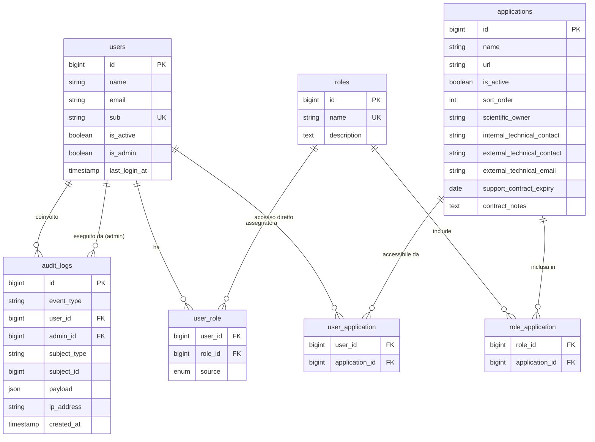

# Design Tecnico — OpenID App Portal

## Overview

Il **OpenID App Portal** è un portale di accesso centralizzato (app launcher) costruito su Laravel 13 + Filament v5. Delega l'autenticazione a un Identity Provider OpenID Connect esterno (Keycloak, Azure AD, Auth0, ecc.) e si occupa esclusivamente di:

- **Autorizzazione**: quali applicazioni può vedere e usare ogni utente
- **Presentazione**: la griglia di app launcher
- **Amministrazione**: pannello Filament per gestire applicazioni, ruoli, permessi, utenti e audit log

Il progetto ha già installato e configurato:
- `dutchcodingcompany/filament-socialite ^3.2` — integrazione Filament + Socialite (login OIDC nel pannello admin già funzionante)
- `kovah/laravel-socialite-oidc ^0.8.0` — provider OIDC per Socialite
- `filament/filament ^5.6` — pannello admin
- Mysql come database di sviluppo

Il **Prompt 1** (Setup OIDC con Laravel Socialite) è già stato implementato. Questo design copre i Prompt 2–8.

---

## Architecture

### Panoramica dei Layer

```
┌─────────────────────────────────────────────────────────────────┐
│                        Browser / Client                         │
└──────────────────────────┬──────────────────────────────────────┘
                           │ HTTPS
┌──────────────────────────▼──────────────────────────────────────┐
│                    Laravel 13 Application                        │
│                                                                  │
│  ┌─────────────────────┐    ┌──────────────────────────────┐    │
│  │   Filament Panel    │    │     Web Routes (Launcher)    │    │
│  │   /admin/*          │    │     /                        │    │
│  │                     │    │                              │    │
│  │  Resources:         │    │  Filament Page:              │    │
│  │  - ApplicationRes.  │    │  - Launcher (griglia app)    │    │
│  │  - UserResource     │    │                              │    │
│  │  - RoleResource     │    └──────────────────────────────┘    │
│  │  - AuditLogResource │                                        │
│  └─────────────────────┘                                        │
│                                                                  │
│  ┌─────────────────────────────────────────────────────────┐    │
│  │                    Service Layer                         │    │
│  │  - OidcRoleSyncService                                   │    │
│  │  - AuditLogService                                       │    │
│  └─────────────────────────────────────────────────────────┘    │
│                                                                  │
│  ┌─────────────────────────────────────────────────────────┐    │
│  │                    Model Layer (Eloquent)                 │    │
│  │  User · Application · Role · AuditLog                    │    │
│  │  Pivot: user_role · user_application · role_application  │    │
│  └─────────────────────────────────────────────────────────┘    │
│                                                                  │
│  ┌─────────────────────────────────────────────────────────┐    │
│  │                    Database ( MySQL)              │    │
│  └─────────────────────────────────────────────────────────┘    │
└─────────────────────────────────────────────────────────────────┘
                           │
┌──────────────────────────▼──────────────────────────────────────┐
│              Identity Provider (OIDC / Keycloak)                 │
│              Gestisce autenticazione e claims ruoli              │
└─────────────────────────────────────────────────────────────────┘
```

### Flusso di Autenticazione (già implementato — Prompt 1)

```
User → GET /admin → FilamentSocialite → GET /admin/oauth/oidc/redirect
     → IdP (login) → GET /admin/oauth/oidc/callback
     → FilamentSocialitePlugin::resolveUserUsing() → OidcRoleSyncService::sync()
     → Session autenticata → Redirect al Launcher
```

### Flusso di Autorizzazione (Launcher)

```
User autenticato → GET / → Launcher Filament Page
                         → User::accessibleApplications()
                         → UNION(direct permissions, role permissions)
                         → Filtra is_active = true
                         → Ordina per sort_order
                         → Griglia card
```

---

## Components and Interfaces

### 1. Migration e Schema Database

#### Migration: `add_oidc_fields_to_users_table`
Aggiunge i campi OIDC al modello User esistente (se non già presenti dal Prompt 1):
- `sub` (string, unique, nullable) — identificatore univoco IdP
- `last_login_at` (timestamp, nullable)
- `is_active` (boolean, default true)
- `is_admin` (boolean, default false)

#### Migration: `create_applications_table`
Tabella principale delle applicazioni del portale.

#### Migration: `create_roles_table`
Tabella dei ruoli assegnabili agli utenti.

#### Migration: `create_role_application_table`
Pivot: associazione Role ↔ Application.

#### Migration: `create_user_role_table`
Pivot: associazione User ↔ Role con campo `source` (enum: `manual`, `oidc`).

#### Migration: `create_user_application_table`
Pivot: permessi diretti User ↔ Application.

#### Migration: `create_audit_logs_table`
Tabella per il log di audit delle azioni rilevanti.

### 2. Modelli Eloquent

#### `App\Models\Application`
- Relazioni: `belongsToMany(Role)`, `belongsToMany(User)` (diretti)
- Scope: `scopeActive()`, `scopeExpiringWithin(int $days)`, `scopeExpired()`
- Accessor: `contractStatus()` → `'expired'|'expiring'|'valid'|null`

#### `App\Models\Role`
- Relazioni: `belongsToMany(Application)`, `belongsToMany(User)` (con pivot `source`)

#### `App\Models\User` (esteso)
- Relazioni: `belongsToMany(Role)` (con pivot `source`), `belongsToMany(Application)` (diretti)
- Metodo: `accessibleApplications(): Collection` — unione senza duplicati, ordinata per `sort_order`
- Metodo: `isAdmin(): bool`

#### `App\Models\AuditLog`
- Nessuna relazione complessa; `user_id` e `admin_id` sono foreign key nullable

### 3. Service Layer

#### `App\Services\OidcRoleSyncService`
```php
interface OidcRoleSyncServiceInterface {
    public function sync(User $user, array $tokenClaims): void;
}
```
Logica:
1. Controlla `OIDC_SYNC_ROLES` env — se false, ritorna immediatamente
2. Legge il claim configurato (`OIDC_ROLES_CLAIM`, default `roles`) dai `$tokenClaims`
3. Trova i `Role` nel DB il cui `name` è in `$claimRoles`
4. Sincronizza con `syncWithoutDetaching` per i ruoli trovati (source = `oidc`)
5. Rimuove i ruoli con `source = 'oidc'` non più presenti nel claim
6. Non tocca i ruoli con `source = 'manual'`

#### `App\Services\AuditLogService`
```php
interface AuditLogServiceInterface {
    public function log(string $eventType, array $context = []): void;
}
```
Metodi helper: `logLogin()`, `logLogout()`, `logApplicationChange()`, `logPermissionChange()`

### 4. Filament Resources

#### `App\Filament\Resources\ApplicationResource`
- Form con due sezioni: "Generale" e "Conformità NIS2"
- Table con badge scadenza contratto colorati
- Filtri per stato contratto
- Bulk actions: attiva/disattiva
- Export CSV con tutti i campi NIS2

#### `App\Filament\Resources\UserResource`
- Form con toggle `is_active`, `is_admin`
- CheckboxList permessi diretti e ruoli
- RelationManager `AccessibleApplicationsRelationManager`

#### `App\Filament\Resources\RoleResource`
- Form: nome, descrizione, CheckboxList applicazioni
- Table: nome, numero applicazioni, numero utenti

#### `App\Filament\Resources\AuditLogResource`
- Read-only (nessun form create/edit)
- Table con badge colorati per tipo evento
- Filtri: tipo evento, utente, intervallo date
- Action "View" con payload JSON formattato

### 5. Filament Pages

#### `App\Filament\Pages\Launcher`
- Pagina Filament accessibile a **tutti** gli utenti autenticati (non solo admin)
- Griglia responsive di card (3 col desktop, 2 tablet, 1 mobile)
- Campo ricerca Livewire in tempo reale
- Usa `auth()->user()->accessibleApplications()` per recuperare le app

### 6. Observers

#### `App\Observers\ApplicationObserver`
- `deleting()`: rimuove tutti i permessi diretti e le associazioni role-application
- `created()`, `updated()`, `deleted()`: registra evento in `audit_logs`

### 7. Artisan Commands

#### `App\Console\Commands\AuditPruneCommand` (`audit:prune`)
- Elimina record `audit_logs` con `created_at < now()->subDays(90)`
- Registrato nello scheduler con `->daily()`

---

## Data Models

### Tabella `users` (estesa)

```sql
ALTER TABLE users ADD COLUMN sub VARCHAR(255) UNIQUE NULL;
ALTER TABLE users ADD COLUMN last_login_at TIMESTAMP NULL;
ALTER TABLE users ADD COLUMN is_active BOOLEAN NOT NULL DEFAULT 1;
ALTER TABLE users ADD COLUMN is_admin BOOLEAN NOT NULL DEFAULT 0;
```

### Tabella `applications`

```sql
CREATE TABLE applications (
    id          BIGINT UNSIGNED AUTO_INCREMENT PRIMARY KEY,
    name        VARCHAR(100) NOT NULL,
    description TEXT NULL,
    url         VARCHAR(500) NOT NULL,
    icon_url    VARCHAR(500) NULL,
    sort_order  INT NOT NULL DEFAULT 0,
    is_active   BOOLEAN NOT NULL DEFAULT 1,

    -- Campi NIS2
    scientific_owner            VARCHAR(150) NULL,
    internal_technical_contact  VARCHAR(150) NULL,
    external_technical_contact  VARCHAR(150) NULL,
    external_technical_email    VARCHAR(255) NULL,
    support_contract_expiry     DATE NULL,
    contract_notes              TEXT NULL,

    created_at  TIMESTAMP NULL,
    updated_at  TIMESTAMP NULL
);
```

### Tabella `roles`

```sql
CREATE TABLE roles (
    id          BIGINT UNSIGNED AUTO_INCREMENT PRIMARY KEY,
    name        VARCHAR(100) NOT NULL UNIQUE,
    description TEXT NULL,
    created_at  TIMESTAMP NULL,
    updated_at  TIMESTAMP NULL
);
```

### Tabella `role_application` (pivot)

```sql
CREATE TABLE role_application (
    role_id        BIGINT UNSIGNED NOT NULL,
    application_id BIGINT UNSIGNED NOT NULL,
    PRIMARY KEY (role_id, application_id),
    FOREIGN KEY (role_id) REFERENCES roles(id) ON DELETE CASCADE,
    FOREIGN KEY (application_id) REFERENCES applications(id) ON DELETE CASCADE
);
```

### Tabella `user_role` (pivot con source)

```sql
CREATE TABLE user_role (
    user_id    BIGINT UNSIGNED NOT NULL,
    role_id    BIGINT UNSIGNED NOT NULL,
    source     ENUM('manual', 'oidc') NOT NULL DEFAULT 'manual',
    PRIMARY KEY (user_id, role_id),
    FOREIGN KEY (user_id) REFERENCES users(id) ON DELETE CASCADE,
    FOREIGN KEY (role_id) REFERENCES roles(id) ON DELETE CASCADE
);
```

### Tabella `user_application` (pivot permessi diretti)

```sql
CREATE TABLE user_application (
    user_id        BIGINT UNSIGNED NOT NULL,
    application_id BIGINT UNSIGNED NOT NULL,
    PRIMARY KEY (user_id, application_id),
    FOREIGN KEY (user_id) REFERENCES users(id) ON DELETE CASCADE,
    FOREIGN KEY (application_id) REFERENCES applications(id) ON DELETE CASCADE
);
```

### Tabella `audit_logs`

```sql
CREATE TABLE audit_logs (
    id           BIGINT UNSIGNED AUTO_INCREMENT PRIMARY KEY,
    event_type   VARCHAR(50) NOT NULL,  -- login, logout, create, update, delete, permission_change
    user_id      BIGINT UNSIGNED NULL,
    admin_id     BIGINT UNSIGNED NULL,
    subject_type VARCHAR(100) NULL,     -- 'Application', 'Role', 'User'
    subject_id   BIGINT UNSIGNED NULL,
    payload      JSON NULL,             -- { before: {...}, after: {...} }
    ip_address   VARCHAR(45) NULL,
    created_at   TIMESTAMP NOT NULL DEFAULT CURRENT_TIMESTAMP,

    FOREIGN KEY (user_id) REFERENCES users(id) ON DELETE SET NULL,
    FOREIGN KEY (admin_id) REFERENCES users(id) ON DELETE SET NULL,
    INDEX idx_event_type (event_type),
    INDEX idx_user_id (user_id),
    INDEX idx_created_at (created_at)
);
```

### Diagramma ER



---

## Correctness Properties

*Una proprietà è una caratteristica o comportamento che deve essere vera per tutte le esecuzioni valide di un sistema — essenzialmente, un'affermazione formale su cosa il sistema deve fare. Le proprietà fungono da ponte tra specifiche leggibili dall'uomo e garanzie di correttezza verificabili automaticamente.*

### Property 1: Upsert utente OIDC preserva il sub come chiave

*Per qualsiasi* profilo utente OIDC (con `sub`, `email`, `name` arbitrari), il metodo di creazione/aggiornamento dell'utente deve produrre esattamente un record nel database con il `sub` corrispondente, e i campi `email` e `name` devono riflettere i valori più recenti del token.

**Validates: Requirements 1.3, 6.1, 6.2**

---

### Property 2: Il Launcher mostra esattamente le applicazioni autorizzate

*Per qualsiasi* utente con un insieme arbitrario di permessi diretti e/o ruoli, il metodo `accessibleApplications()` deve restituire esattamente l'insieme delle applicazioni attive per cui l'utente ha un permesso (diretto o tramite ruolo), senza applicazioni in più né in meno.

**Validates: Requirements 2.1, 4.3**

---

### Property 3: Nessun duplicato nell'unione dei permessi

*Per qualsiasi* utente che possiede sia permessi diretti che permessi derivati da ruoli su una stessa applicazione, `accessibleApplications()` deve restituire quella applicazione esattamente una volta.

**Validates: Requirements 4.4**

---

### Property 4: Ordinamento per sort_order

*Per qualsiasi* insieme di applicazioni con valori `sort_order` arbitrari, il risultato di `accessibleApplications()` deve essere ordinato in modo non decrescente per `sort_order`.

**Validates: Requirements 2.5**

---

### Property 5: Ricerca filtra per nome e descrizione

*Per qualsiasi* query di ricerca non vuota e qualsiasi insieme di applicazioni, il risultato del filtro deve contenere solo applicazioni il cui `name` o `description` contiene la query (case-insensitive), e nessuna applicazione che non soddisfa questo criterio.

**Validates: Requirements 2.6**

---

### Property 6: Applicazione disattivata non appare nel Launcher

*Per qualsiasi* utente con permesso su un'applicazione, se l'applicazione viene disattivata (`is_active = false`), essa non deve apparire nel risultato di `accessibleApplications()`.

**Validates: Requirements 3.6**

---

### Property 7: Eliminazione applicazione rimuove tutti i permessi associati

*Per qualsiasi* applicazione con un numero arbitrario di permessi diretti e associazioni a ruoli, dopo l'eliminazione dell'applicazione non devono esistere record in `user_application` né in `role_application` che referenziano quell'applicazione.

**Validates: Requirements 3.7**

---

### Property 8: Badge scadenza contratto riflette la data corrente

*Per qualsiasi* applicazione con un valore `support_contract_expiry` arbitrario, l'accessor `contractStatus()` deve restituire:
- `'expired'` se la data è nel passato
- `'expiring'` se la data è entro 30 giorni dalla data corrente
- `'valid'` se la data è oltre 30 giorni nel futuro
- `null` se il campo è null

**Validates: Requirements 3.9, 3.10**

---

### Property 9: Filtro contratto in scadenza è coerente con contractStatus

*Per qualsiasi* insieme di applicazioni con date di scadenza arbitrarie, applicando il filtro "Scaduto" o "Entro N giorni", il risultato deve contenere esattamente le applicazioni il cui `contractStatus()` corrisponde al criterio del filtro.

**Validates: Requirements 3.11**

---

### Property 10: Export CSV contiene tutti i campi NIS2

*Per qualsiasi* insieme di applicazioni con valori NIS2 arbitrari, il CSV esportato deve contenere una riga per ogni applicazione con tutti i campi NIS2 (`scientific_owner`, `internal_technical_contact`, `external_technical_contact`, `external_technical_email`, `support_contract_expiry`, `contract_notes`) valorizzati correttamente.

**Validates: Requirements 3.12**

---

### Property 11: Assegnazione ruolo concede accesso a tutte le applicazioni del ruolo

*Per qualsiasi* ruolo con un insieme arbitrario di applicazioni associate, assegnare quel ruolo a un utente deve risultare in `accessibleApplications()` che include tutte le applicazioni del ruolo.

**Validates: Requirements 4.3**

> Nota: questa proprietà è distinta dalla Property 2 perché testa specificamente il percorso "via ruolo" in isolamento, mentre la Property 2 testa l'unione complessiva.

---

### Property 12: Revoca permesso diretto preserva l'accesso via ruolo

*Per qualsiasi* utente che ha accesso a un'applicazione sia tramite permesso diretto che tramite un ruolo, revocare il permesso diretto non deve rimuovere l'applicazione da `accessibleApplications()`.

**Validates: Requirements 4.5**

---

### Property 13: Idempotenza dell'assegnazione permesso

*Per qualsiasi* coppia (utente, applicazione), assegnare il permesso diretto N volte (N ≥ 1) deve produrre esattamente un record in `user_application`, senza errori.

**Validates: Requirements 4.7**

---

### Property 14: Sincronizzazione ruoli OIDC assegna i ruoli corrispondenti

*Per qualsiasi* insieme di nomi di ruoli nel claim OIDC che corrispondono a ruoli esistenti nel database, dopo `OidcRoleSyncService::sync()` l'utente deve avere esattamente quei ruoli con `source = 'oidc'`.

**Validates: Requirements 5.2**

---

### Property 15: Sincronizzazione OIDC preserva i ruoli manuali

*Per qualsiasi* utente con un insieme arbitrario di ruoli manuali (`source = 'manual'`) e ruoli OIDC, dopo `OidcRoleSyncService::sync()` con qualsiasi claim, i ruoli manuali devono rimanere invariati.

**Validates: Requirements 5.3**

---

### Property 16: Sincronizzazione OIDC ignora ruoli sconosciuti senza errori

*Per qualsiasi* insieme di nomi di ruoli nel claim OIDC che non corrispondono a nessun ruolo nel database, `OidcRoleSyncService::sync()` deve completare senza eccezioni e senza creare nuovi ruoli nel database.

**Validates: Requirements 5.5**

---

### Property 17: Utente disabilitato non può accedere al Launcher

*Per qualsiasi* utente con `is_active = false`, qualsiasi richiesta al Launcher deve essere rifiutata (redirect o errore), indipendentemente dallo stato della sessione OIDC.

**Validates: Requirements 6.5**

---

### Property 18: Tutte le rotte protette richiedono autenticazione

*Per qualsiasi* rotta del Launcher, una richiesta non autenticata deve risultare in un redirect al flusso OIDC (non in una risposta 200).

**Validates: Requirements 7.1**

---

### Property 19: Tutte le rotte admin richiedono ruolo amministrativo

*Per qualsiasi* rotta del pannello Filament admin, una richiesta da un utente autenticato ma privo del ruolo amministrativo deve risultare in HTTP 403.

**Validates: Requirements 7.2**

---

### Property 20: Ogni login registra un evento di audit

*Per qualsiasi* utente che completa con successo il flusso OIDC, deve esistere un record in `audit_logs` con `event_type = 'login'`, `user_id` corrispondente, e `created_at` recente.

**Validates: Requirements 8.1**

---

### Property 21: Ogni modifica applicazione registra before/after nell'audit log

*Per qualsiasi* modifica (create/update/delete) a un'applicazione, il record in `audit_logs` deve contenere nel campo `payload` i dati `before` e `after` che riflettono correttamente lo stato dell'applicazione prima e dopo la modifica.

**Validates: Requirements 8.3**

---

### Property 22: Il comando audit:prune elimina solo i record più vecchi di 90 giorni

*Per qualsiasi* insieme di record in `audit_logs` con date arbitrarie, dopo l'esecuzione di `audit:prune` devono rimanere esattamente i record con `created_at >= now()->subDays(90)` e devono essere stati eliminati tutti i record con `created_at < now()->subDays(90)`.

**Validates: Requirements 8.6**

---

## Error Handling

### Errori di Autenticazione OIDC
- **Token non valido / scaduto**: `FilamentSocialite` gestisce già il flusso; in caso di eccezione Socialite, il plugin reindirizza alla pagina di login con messaggio di errore.
- **Utente disabilitato**: nel callback `resolveUserUsing()`, se `$user->is_active === false`, lanciare `\DutchCodingCompany\FilamentSocialite\Exceptions\UserNotAllowed` (o equivalente) per bloccare l'accesso e mostrare messaggio.
- **Stato CSRF OIDC non valido**: gestito automaticamente da Socialite tramite il parametro `state`.

### Errori di Validazione (Filament Forms)
- Campi obbligatori mancanti: Filament mostra errori inline sotto ogni campo.
- URL non HTTPS: `Hint` di avviso visivo nel form (non blocca il salvataggio, solo avviso).
- Email non valida per `external_technical_email`: validazione `email` standard Laravel.

### Errori di Integrità Database
- Permesso duplicato: gestito con `firstOrCreate()` / `syncWithoutDetaching()` — nessuna eccezione esposta all'utente.
- Eliminazione applicazione con permessi: gestita dall'`ApplicationObserver` prima del delete (cleanup esplicito) e dalle foreign key `ON DELETE CASCADE` come fallback.

### Errori del Comando Artisan `audit:prune`
- Se il database non è raggiungibile, il comando fallisce con exit code 1 e logga l'errore in `storage/logs/laravel.log`.
- Il comando è idempotente: eseguirlo più volte produce lo stesso risultato.

### Errori di Sincronizzazione Ruoli OIDC
- Claim assente: `OidcRoleSyncService` controlla l'esistenza del claim prima di procedere; se assente, ritorna senza modifiche.
- Ruolo sconosciuto nel claim: ignorato silenziosamente (nessun log di errore, solo skip).
- Eccezione database durante sync: propagata come eccezione non gestita (il login fallisce con errore generico — preferibile a un login parzialmente sincronizzato).

---

## Testing Strategy

### Approccio Duale

Il progetto usa **PHPUnit** (già presente in `composer.json` come `phpunit/phpunit ^12.5.12`).

Per i property-based test si usa **[eris/eris](https://github.com/giorgiosironi/eris)** (libreria PBT per PHP) oppure, in alternativa, **[phpunit-quickcheck](https://github.com/steos/php-quickcheck)**. La scelta raccomandata è `eris/eris` per la sua integrazione nativa con PHPUnit e il supporto a generatori compositi.

```bash
composer require --dev eris/eris
```

Ogni property test deve essere configurato con **minimo 100 iterazioni**:
```php
use Eris\TestTrait;

class MyPropertyTest extends TestCase
{
    use TestTrait;

    public function test_property_example(): void
    {
        $this->forAll(
            Generator\string(),
            Generator\int()
        )->withMaxSize(100)
         ->then(function (string $s, int $n) {
             // assertion
         });
    }
}
```

Tag format per ogni property test:
```php
// Feature: openid-app-portal, Property N: <testo della proprietà>
```

### Unit Tests (`tests/Unit/`)

| Classe di Test | Proprietà Coperte |
|---|---|
| `OidcRoleSyncServiceTest` | Property 14, 15, 16 |
| `ApplicationContractStatusTest` | Property 8 |
| `UserAccessibleApplicationsTest` | Property 2, 3, 4, 6, 12, 13 |
| `AuditPruneCommandTest` | Property 22 |

### Feature Tests (`tests/Feature/`)

| Classe di Test | Proprietà / Requisiti Coperti |
|---|---|
| `OidcAuthTest` | Property 1, 17, 18; Req 1.1–1.7 |
| `LauncherTest` | Property 2, 4, 5, 6; Req 2.1–2.7 |
| `PermissionTest` | Property 3, 11, 12, 13; Req 4.1–4.7 |
| `AdminAuthorizationTest` | Property 19; Req 7.1–7.2 |
| `AuditLogTest` | Property 20, 21, 22; Req 8.1–8.6 |
| `ApplicationResourceTest` | Property 7, 9, 10; Req 3.1–3.12 |
| `RoleSyncFeatureTest` | Property 14, 15, 16; Req 5.1–5.5 |

### Test di Integrazione

- Verificano il flusso completo OIDC con Socialite mockato
- Verificano l'export CSV con dati reali nel database di test
- Usano `RefreshDatabase` trait per isolamento

### Convenzioni

- Tutti i test usano `RefreshDatabase` o `DatabaseTransactions`
- Socialite mockato con `Socialite::shouldReceive()` o `Socialite::fake()`
- Factory per tutti i modelli: `ApplicationFactory`, `RoleFactory`, `AuditLogFactory`
- I property test usano generatori Eris per: stringhe arbitrarie, date arbitrarie, interi, array di ID
